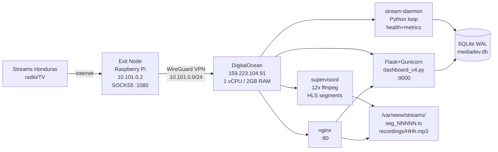

# MediaDEV Stream Monitor

Sistema de monitoreo 24/7 para 12 estaciones de radio y TV de Honduras.

## Por qué existe este sistema

Las emisoras hondureñas bloquean acceso desde IPs extranjeras (geo-restriction).
El servidor en DigitalOcean necesita enrutar sus conexiones a través de una IP residencial de Honduras.
La solución es un nodo de salida (Raspberry Pi) conectado via WireGuard, que expone un proxy SOCKS5.
El servidor captura los streams vía ese proxy, los recodifica a audio HLS, y los sirve en un dashboard web.
El objetivo final es monitoreo continuo y capacidad de auditoría/transcripción del audio.

## Arquitectura



## Componentes

### 1. Exit Node (Raspberry Pi / Gateway temporal)
Nodo físico en Honduras con IP residencial. Corre un proxy SOCKS5 en puerto 1080.
Conectado al servidor via WireGuard (peer 10.101.0.2).
**Crítico**: sin este nodo los streams son inaccesibles por geo-restriction.

Gateways disponibles:
- `10.101.0.2` — Raspberry Pi Honduras (principal)
- `10.101.0.3` — PC Sedesol Windows (temporal)
- `10.101.0.4` — Mac Developer (temporal)

### 2. WireGuard VPN
Túnel cifrado entre el servidor y los nodos de salida.
Config servidor: `/etc/wireguard/wg0.conf` (escucha en :51820)
Cada nodo tiene su propio par de claves y IP en 10.101.0.0/24.

### 3. Proxy Layer (dos patrones)
- **SOCKS5 directo**: `curl --socks5-hostname 10.101.0.X:1080 URL | ffmpeg -i pipe:0`
- **Privoxy HTTP**: `ffmpeg -http_proxy http://127.0.0.1:3128` donde Privoxy reenvía a SOCKS5

### 4. Captura HLS (supervisord + ffmpeg)
12 procesos ffmpeg persistentes, uno por stream.
Recodifican a: AAC mono 64kbps 22050Hz, segmentos de 4s, playlist HLS de 10 segmentos.
La bandera `-vn` elimina el video de streams de TV.
Segmentos NO se eliminan por ffmpeg (`append_list` sin `delete_segments`) — se acumulan para auditoría.

### 5. Stream Daemon (Python)
Loop único que reemplaza 5 cron jobs anteriores. Intervalos conservadores para 1 vCPU:

| Tarea | Intervalo | Descripción |
|---|---|---|
| Health check | 15s | Verifica m3u8 age + segs, maneja Circuit Breaker |
| Indexer | 60s | Registra nuevos .ts en SQLite por mtime |
| Metrics | 60s | Snapshot minuto a minuto en BD |
| Recordings | 120s | Genera MP3 horario de la hora anterior |
| Cleanup | 30min | Elimina .ts > 8h, purga métricas > 7 días |

**Por qué estos intervalos**: originalmente el daemon tenía health=3s y index=10s. En producción saturó el servidor a 97% CPU y 95.5% RAM causando un crash. Los intervalos actuales son el mínimo seguro para 1 vCPU.

### 6. Dashboard Flask
`dashboard_v4.py` con Gunicorn (1 worker). Optimizado con queries GROUP BY batch (4-5 queries vs 72 anteriores).
Tiempo de respuesta: ~30ms dashboard principal, ~50ms detalle de stream.

### 7. Base de Datos SQLite WAL
Modo WAL permite lectura concurrente (dashboard) sin bloquear escritura (daemon).

```sql
stream_status (stream_id PK, status, sup, segs, age, cb_state, cb_fails, cb_since,
               restart_today, last_down, last_up, updated_at)

metrics       (stream_id, ts, status, segs, bytes)          -- retención 7 días
segments      (stream_id, filename, ts_start, ts_end, bytes) -- retención 8h
events        (id, stream_id, ts, etype, detail)             -- retención 30 días
```

## Topología de red

```
Internet
  └── Honduras ISP (IP residencial)
        └── Raspberry Pi :1080 SOCKS5
              └── WireGuard tunnel (UDP :51820)
                    └── DigitalOcean 159.223.104.91
                          ├── nginx :80 (reverse proxy)
                          │     ├── / → gunicorn :9000 (Flask)
                          │     └── /streams/ → /var/www/streams/ (static HLS)
                          ├── Privoxy :3128 (HTTP→SOCKS5)
                          └── 12x ffmpeg (supervisord)
```

## Estructura de carpetas

```
/opt/media-ai/
├── CLAUDE.md               # Contexto raíz para Claude Code
├── README.md               # Este archivo
├── config/
│   └── stations.json       # Metadatos de estaciones
├── daemon/
│   ├── CLAUDE.md
│   └── stream_daemon.py    # Daemon principal (activo)
├── dashboard/
│   ├── CLAUDE.md
│   ├── dashboard_v4.py     # Flask app activa
│   └── templates/
│       ├── dashboard_main.html
│       └── stream_detail.html
├── scripts/
│   ├── CLAUDE.md
│   └── stream_*.sh         # 12 scripts ffmpeg (uno por stream)
└── scripts_backup_rpi/     # Backup con IPs de la Pi (10.101.0.2)

/var/www/streams/
├── mediadev.db             # SQLite WAL (única fuente de verdad)
├── {stream_id}/
│   ├── index.m3u8          # Playlist HLS activa
│   ├── seg_NNNNN.ts        # Segmentos de audio (últimas 8h)
│   └── recordings/
│       └── YYYY-MM-DD_HHh.mp3  # Grabaciones horarias (hora GMT-6)
└── audit_index/            # Legado CSV/JSONL (ya migrado a SQLite)
```

## Zona horaria
Todo el sistema usa **America/Tegucigalpa (GMT-6 / CST)**.
- Servidor OS: `timedatectl` → America/Tegucigalpa
- Python: `TGU = timezone(timedelta(hours=-6))` definido en dashboard y daemon
- SQLite: timestamps como Unix epoch (tz-neutral) — conversión solo en la capa de presentación

## Despliegue — orden de arranque
```bash
systemctl start wg-quick@wg0         # 1. VPN primero
systemctl start supervisor            # 2. Streams ffmpeg
systemctl start stream-daemon         # 3. Daemon de monitoreo
systemctl start dashboard-mediadev   # 4. Dashboard web
systemctl start nginx                 # 5. Reverse proxy
```

Todos tienen `systemctl enable` — arrancan automáticamente en reboot.

## Verificar estado completo
```bash
wg show wg0                           # Peers WireGuard (debe mostrar handshake reciente)
supervisorctl status                  # 12 streams — todos deben estar RUNNING
systemctl is-active stream-daemon dashboard-mediadev nginx privoxy
curl -s http://127.0.0.1:9000/api/status | python3 -m json.tool
```

## Monitoreo y logs
```bash
journalctl -u stream-daemon -f        # Health checks, CB events, grabaciones
journalctl -u dashboard-mediadev -f   # Errores Flask/Gunicorn
tail -f /var/log/nginx/access.log     # Accesos HTTP
supervisorctl tail stream_fm_941 stderr   # Errores de stream específico
```

## Circuit Breaker
Protege contra restart storms cuando un stream está permanentemente caído:
- 5 fallos consecutivos → CB OPEN → stream marcado DISABLED (deja de reiniciar)
- 30 minutos después → CB CLOSE automático → intenta reconectar
- Visible en dashboard con badge "CB" en rojo
- Reset manual: `UPDATE stream_status SET cb_state='CLOSED', cb_fails=0`

## Auditoría de audio
- Segmentos .ts se acumulan en disco durante 8 horas
- El daemon genera `recordings/YYYY-MM-DD_HHh.mp3` al inicio de cada hora
- Para extraer audio por timestamp: consultar tabla `segments` y concatenar los .ts del rango
- Formato: AAC 64kbps mono 22050Hz — compatible con transcripción Whisper

## Recuperación ante desastres

### Gateway WireGuard desconectado
Todos los streams caen. Para recuperar:
1. Reconectar el nodo de salida (`sudo systemctl restart wg-quick@wg1` en la Pi)
2. Esperar 30min para reset automático de CB, o resetear manualmente
3. `supervisorctl restart all`

### Servidor saturado (CPU > 80%)
1. Revisar intervalos del daemon — no reducir por debajo de los valores en CLAUDE.md
2. Verificar que do_health() no esté haciendo glob en disco
3. Gunicorn debe tener exactamente 1 worker
4. Si persiste: `supervisorctl stop all` temporalmente

### Reboot del servidor
Todos los servicios arrancan automáticamente via systemd. Recovery time: ~2 minutos.

## Cambiar gateway SOCKS5
```bash
NUEVA_IP="10.101.0.X"
sed -i "s/10\.101\.0\.[0-9]*:1080/${NUEVA_IP}:1080/g" /opt/media-ai/scripts/stream_*.sh
sed -i "s/forward-socks5  \/  10\.101\.0\.[0-9]*:1080/forward-socks5  \/  ${NUEVA_IP}:1080/" /etc/privoxy/config
systemctl restart privoxy
python3 -c "import sqlite3; db=sqlite3.connect('/var/www/streams/mediadev.db'); db.execute(\"UPDATE stream_status SET cb_state='CLOSED',cb_fails=0\"); db.commit()"
supervisorctl restart all
```

## Consideraciones de seguridad
- Acceso SSH via llave privada (keySED) — no contraseña
- UFW activo: puertos 22, 80, 443, 51820/udp
- WireGuard cifra todo el tráfico del proxy
- Dashboard sin autenticación (red interna / IP pública conocida)
- SQLite sin cifrado — datos de audio no sensibles por diseño

## Mejoras futuras identificadas
- Alertas via Telegram/webhook cuando streams caen
- Transcripción automática con Whisper AI
- Detección de publicidad con fingerprinting (AudD/Chromaprint)
- Servidor MediaAI (165.227.196.31) pendiente de configurar
- Autenticación en el dashboard
