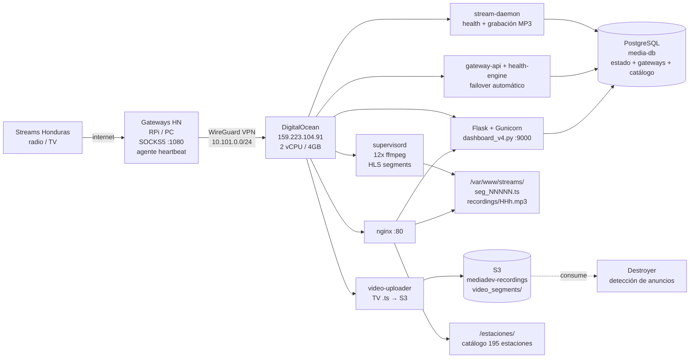

# MediaDEV Stream Monitor

Sistema de monitoreo, grabación y auditoría 24/7 para estaciones de radio y TV de Honduras.
Captura streams en vivo a través de gateways residenciales hondureños, los sirve como HLS,
archiva el contenido (audio MP3 + video en S3) y alimenta el motor de detección de
publicidad (Destroyer).

> **Documentación viva completa:** [`live_mediaDEV.md`](live_mediaDEV.md) — referencia técnica detallada del ecosistema completo (infraestructura, DB, Destroyer, MCP, decisiones de diseño). Actualizar cuando cambie la arquitectura.

> ⚠️ **Topología — 2 nodos (split 14 jun 2026):** este repo es el código de **mediaCAP** (nodo de captura, `159.223.104.91`). El producto **`publiaudit-api`** (SaaS + evidence portal) y la orquestación del **Destroyer** (launcher + watchdog) se movieron a un 2º nodo **mediaAPP** (`137.184.53.234`), misma VPC. El **dashboard viejo (`dashboard_v4.py`) fue eliminado** (harán uno nuevo) — las secciones de este README que lo mencionan son referencia histórica. mediaCAP corre: ffmpeg + stream-daemon + video-uploader + gateways + wireguard + monitor + MCP. Ver [`live_mediaDEV.md`](live_mediaDEV.md) §1 para el detalle por nodo.

## Por qué existe este sistema

Las emisoras hondureñas bloquean el acceso desde IPs extranjeras (geo-restriction).
El servidor en DigitalOcean necesita enrutar sus conexiones a través de una IP residencial
de Honduras. La solución es una red de **nodos de salida** (Raspberry Pi / PCs en Honduras)
conectados vía WireGuard, cada uno exponiendo un proxy SOCKS5. Un **health engine** elige
el mejor gateway y hace failover automático si uno cae.

El servidor captura los streams vía ese proxy, recodifica el audio a HLS, preserva el video
de los canales de TV, y lo sirve en dashboards web. El contenido archivado alimenta la
auditoría/transcripción y la detección de anuncios.

## Arquitectura



## Componentes

### 1. Red de Gateways (nodos de salida en Honduras)
Nodos físicos con IP residencial hondureña, cada uno corriendo un proxy SOCKS5 en :1080
y un **agente** (`gateway_agent.py`) que envía heartbeats al servidor con métricas de salud.
**Crítico**: sin al menos un gateway activo los streams son inaccesibles por geo-restriction.

Gateways configurados (`config/stations.json`):

| ID | Nombre | VPN IP | Rol | Prioridad |
|---|---|---|---|---|
| `hn01` | Honduras Raspberry 01 | 10.101.0.2 | failover-1 | 2 |
| `hn02` | PC-LCE Gateway | 10.101.0.5 | **primary (activo)** | 1 |
| `hn03` | RPi-Levi | 10.101.0.6 | failover-2 | 3 |

### 2. Gateway Health Engine + API
El cerebro de la red de gateways, corre en MediaDEV como dos servicios:
- **`gateway_api.py`** (`mediadev-gateway-api`) — Flask que recibe heartbeats de los agentes.
  Auth por `Bearer <GATEWAY_API_TOKEN>`. Endpoints: `/heartbeat`, `/status`, `/command`, `/health`.
- **`health_engine.py`** (`mediadev-health-engine`) — daemon que calcula el Health Score (0-100)
  de cada gateway, mantiene la máquina de estados
  (`healthy → degraded → failing → failed → probation → healthy`), detecta gateways colgados,
  **ejecuta failover automático**, evita flapping y envía alertas por Telegram.

Estado y telemetría se guardan en **PostgreSQL (media-db)**. El cambio de gateway lo aplica
`gateway_switch.sh`, que actualiza la fuente de verdad central
**`/etc/mediadev/gateway.conf`** (exporta `GW_SOCKS5`), el proxy Privoxy y el estado en
`stations.json`, y reinicia los streams. Los 7 scripts que usan SOCKS5 leen el gateway con
`source /etc/mediadev/gateway.conf` — no tienen la IP hardcodeada.

### 3. WireGuard VPN
Túnel cifrado entre el servidor y los nodos de salida.
Config servidor: `/etc/wireguard/wg0.conf` (escucha en :51820).
Cada nodo tiene su par de claves e IP en `10.101.0.0/24`.

### 4. Proxy Layer (dos patrones)
- **SOCKS5 directo**: `curl --socks5-hostname 10.101.0.X:1080 URL | ffmpeg -i pipe:0`
- **Privoxy HTTP**: `ffmpeg -http_proxy http://127.0.0.1:3128` donde Privoxy reenvía a SOCKS5

### 5. Captura HLS (supervisord + runner unificado)
12 procesos persistentes, uno por stream, todos invocan el **runner único**
`stream_run.sh <id>` (supervisord). El runner lee `url`/`type`/`route` de `stations.json` y
decide captura, transporte y salida:
- **10 radios** → audio AAC mono 64kbps 22050Hz, `-vn` (sin video).
- **2 canales TV** (`hch_tv`, `teleceiba`) → **preservan video** con `-c:v copy -c:a aac -b:a 128k`.

El campo `route` en `stations.json` define el transporte:

| `route` | Comportamiento |
|---|---|
| `gateway` | Siempre por el gateway (fuentes geo-bloqueadas fijas, ej. ice42) — 7 streams |
| `auto` | Prueba directo; si falla usa gateway. **Re-evalúa en cada arranque** → si bloquean una fuente directa, el reinicio cae solo al gateway (fallback automático) — 5 streams |
| `direct` | Siempre directo, sin fallback |

Hoy van directo (vía `auto`): radio_america, radio_globo, radio_el_patio y las 2 TV. El resto
(ice42) requiere gateway. El runner detecta Icecast (curl-pipe) vs ffmpeg y audio vs video solo.

Segmentos de 4s, playlist HLS de 10 segmentos. Los .ts NO se eliminan por ffmpeg
(`append_list` sin `delete_segments`) — se acumulan para auditoría y para el uploader de video.

### 6. Video Segment Uploader (TV → S3)
`video_segment_uploader.py` (`video-segment-uploader`) escanea cada 15s los segmentos .ts
de los streams de TV y los sube a S3 nombrados por epoch:

```
s3://mediadev-recordings/video_segments/{stream_id}/{YYYY}/{MM}/{DD}/{epoch_start}_{epoch_end}.ts
```

Calcula el epoch desde el `mtime` del archivo (sin depender de SQLite). Estos segmentos
son la fuente que **Destroyer** consume para reconstruir clips de video de los anuncios detectados.

### 7. Stream Daemon (Python)
Loop único de mantenimiento. El estado operativo vive **en memoria** (se recalcula desde el
filesystem con los `mtime`) y se **espeja a PostgreSQL** para que lo lea el dashboard. Si la
DB no está disponible, el daemon sigue operando con normalidad — PostgreSQL es solo el espejo.

| Tarea | Intervalo | Descripción |
|---|---|---|
| Health check | 15s | Verifica m3u8 age + segs, maneja Circuit Breaker, UPSERT estado a PG |
| Metrics | 60s | Snapshot (status + bytes del último minuto) → `mediadev_metrics` |
| Recordings | 120s | Genera MP3 horario de la hora anterior |
| Cleanup | 30min | Elimina .ts > 8h, purga métricas (>7d) y eventos (>30d) en PG |
| Daily reset | 1h | Resetea contadores diarios (restart_today, etc.) |

Las transiciones de estado (DOWN/UP, CB_OPEN/CB_CLOSE) se registran en `mediadev_events`.

**Por qué estos intervalos**: en una versión anterior con health=3s e index=10s el daemon
saturó el servidor (97% CPU). Estos son el mínimo seguro. El loop principal hace `sleep(2)`.

### 8. Dashboards (Flask + estático)
- **Dashboard principal** (`/`): `dashboard_v4.py` con Gunicorn (1 worker). KPIs de salud,
  uptime y métricas de los 12 streams. Queries GROUP BY batch (~30ms respuesta).
- **Catálogo de estaciones** (`/estaciones/`): página estática que lista las **195 estaciones**
  (12 grabando + 183 en catálogo) con reproductor en vivo (HLS.js para M3U8, HTML5 audio para
  el resto). Datos del `stream_catalog` en media-db.

### 9. Base de Datos — PostgreSQL (DO Managed, media-db)
Toda la persistencia vive en **una sola PostgreSQL managed** (media-db), compartida con
Destroyer. Ya no se usa SQLite local — el daemon mantiene el estado en memoria y lo espeja aquí.

Tablas propias de MediaDEV (prefijo `mediadev_`):
```sql
mediadev_stream_status (stream_id PK, status, sup, segs, age, cb_state, cb_fails,
                        cb_since, restart_today, last_down, last_up, updated_at)
mediadev_metrics       (stream_id, ts, status, segs, bytes)   -- snapshot 60s, retención 7 días
mediadev_events        (id, stream_id, ts, etype, detail)     -- transiciones, retención 30 días
```
> La auditoría de segmentos (`segs`/MB en disco) se deriva en vivo del filesystem en el
> dashboard — no se registra cada `.ts` en la DB para evitar tráfico innecesario.

Tablas compartidas con Destroyer:
- `stream_catalog` — catálogo de 195 estaciones (activas + inactivas) con stream_url, logo, ciudad.
- Estado y telemetría de la red de gateways.
- Detección de anuncios (`found_detections`, `advertisements`, ...).

**Credenciales**: `/etc/mediadev-db.env` (`PG_HOST/PORT/DB/USER/PASS`, `chmod 600`), cargado por
systemd en el daemon y el dashboard vía `EnvironmentFile`.

### 10. Monitoreo WireGuard (Telegram)
`monitor/monitor.py` (`mediadev-monitor`) — vigila el túnel WireGuard y envía alertas por
Telegram cuando hay problemas de conectividad con los gateways.

## API REST (JSON)
Endpoints read-only servidos por `dashboard_v4.py` (vía nginx en `http://159.223.104.91`),
pensados para consumo externo y para construir interfaces (p.ej. Claude Design). Sin
autenticación, misma política que el panel.

| Endpoint | Descripción |
|---|---|
| `GET /api/summary` | KPIs globales: streams en vivo, catálogo, detecciones (hoy/total) |
| `GET /api/streams` | Estado de salud en vivo de los 12 streams grabando (alias de `/api/status`) |
| `GET /api/stations` | Catálogo completo de estaciones. Filtros: `?status=active\|inactive`, `?type=radio\|tv` |
| `GET /api/detections` | Detecciones de anuncios recientes (con nombre de anuncio y estación). `?limit=N` (máx 500) |

Todos devuelven `{ ...datos, "updated": <ISO-8601 GMT-6> }`. Ejemplos:
```bash
curl http://159.223.104.91/api/summary
curl 'http://159.223.104.91/api/stations?type=tv'
curl 'http://159.223.104.91/api/detections?limit=20'
```

## Topología de red

```
Internet
  └── Honduras ISP (IP residencial)
        └── Gateway HN :1080 SOCKS5 + agente heartbeat
              └── WireGuard tunnel (UDP :51820)
                    └── DigitalOcean 159.223.104.91 (2 vCPU / 4GB)
                          ├── nginx :80 (reverse proxy)
                          │     ├── /           → gunicorn :9000 (dashboard salud)
                          │     ├── /estaciones/ → catálogo estático (195 estaciones)
                          │     └── /streams/    → /var/www/streams/ (HLS estático)
                          ├── Privoxy :3128 (HTTP→SOCKS5)
                          ├── 12x ffmpeg (supervisord)
                          ├── gateway-api + health-engine (failover)
                          └── video-uploader → S3
```

## Estructura de carpetas

```
/opt/media-ai/
├── CLAUDE.md               # Contexto raíz para Claude Code
├── README.md               # Este archivo
├── config/
│   └── stations.json       # Estaciones activas + definición de gateways
├── daemon/
│   └── stream_daemon.py    # Daemon de health + grabación MP3
├── dashboard/
│   ├── dashboard_v4.py     # Flask app (dashboard de salud)
│   └── templates/
├── monitor/
│   └── monitor.py          # Monitoreo WireGuard + alertas Telegram
└── scripts/
    ├── stream_run.sh           # Runner unificado (lee url/type/route de stations.json)
    ├── video_segment_uploader.py   # TV .ts → S3
    ├── gateway_switch.sh           # Aplica cambio de gateway activo
    ├── gateway_watchdog.py         # Watchdog del gateway
    ├── deploy_peer_b.sh            # Deploy de peer B
    ├── backup_healthcheck.py       # Health check de backups
    └── release.sh                  # Publica nueva release del Destroyer a S3

/etc/mediadev/gateway.conf      # Gateway activo (fuente de verdad; vía gateway_switch.sh)
/etc/mediadev-s3.env            # Credenciales AWS S3 (chmod 600)
/etc/mediadev-db.env            # Credenciales PostgreSQL media-db (chmod 600)

/opt/destroyer/gateway/         # Sistema de gateways (engine + agente)
├── engine/
│   ├── gateway_api.py          # API de heartbeats (corre en MediaDEV)
│   └── health_engine.py        # Motor de salud + failover (corre en MediaDEV)
└── agent/
    ├── gateway_agent.py        # Agente que corre en cada gateway HN
    └── install.sh

/var/www/streams/
├── {stream_id}/
│   ├── index.m3u8          # Playlist HLS activa
│   ├── seg_NNNNN.ts        # Segmentos (audio, o audio+video en TV) — últimas 8h
│   └── recordings/
│       └── YYYY-MM-DD_HHh.mp3   # Grabaciones horarias de audio (GMT-6)
└── audit_index/            # Legado CSV/JSONL (en desuso)

/var/www/html/estaciones/
└── index.html             # Dashboard de catálogo (195 estaciones)
```

## Relación con Destroyer
**Destroyer** es el sistema de detección de publicidad (droplet efímero `c-16`, corre 4x/día).
MediaDEV es su proveedor de datos:
- Los segmentos de audio/video capturados aquí son la materia prima.
- Los **segmentos de video en S3** (`video_segments/`) permiten que Destroyer reconstruya clips
  de video MP4 de cada anuncio detectado en TV.
- Comparten la base **PostgreSQL media-db** (catálogo, detecciones, anuncios, gateways).

**Sistema de releases S3** (implementado 13 jun 2026): el snapshot base del Destroyer contiene
solo el OS y las dependencias. El código (`worker.py`, `fingerprint.py`) se descarga desde
`s3://mediadev-recordings/destroyer/releases/` al arrancar el droplet. Para publicar una nueva
versión: `./scripts/release.sh vX` en el servidor. Ver [`MEDIADEV_DESTROYER_RELEASES.md`](MEDIADEV_DESTROYER_RELEASES.md).

## Zona horaria

**Backend UTC, display GMT-6** (cutover: 13 jun 2026 16:07 UTC).

- Todas las timestamps en PostgreSQL son **UTC** (`TIMESTAMPTZ`)
- El campo `pipeline_version` distingue datos históricos (`legacy`, pre-cutover) de los nuevos (`utc_v2`)
- Honduras no tiene DST — offset siempre fijo: `UTC - 6h`
- Frontend convierte: `airTimeHN = airTimeUtc - 6h`
- Servidor OS: `timedatectl` → UTC
- Python: `datetime.now(timezone.utc)`

## Despliegue — orden de arranque (mediaCAP, nodo de captura)
```bash
systemctl start wg-quick@wg0          # 1. VPN primero
systemctl start supervisor             # 2. Streams ffmpeg
systemctl start stream-daemon          # 3. Daemon de monitoreo
systemctl start mediadev-gateway-api   # 4. API de heartbeats
systemctl start mediadev-health-engine # 5. Motor de failover
systemctl start mediadev-monitor       # 6. Monitoreo WireGuard
systemctl start video-segment-uploader # 7. Uploader de video TV
systemctl start nginx                  # 8. Reverse proxy (HLS /streams/)
```

Todos tienen `systemctl enable` — arrancan automáticamente en reboot.
> `dashboard-mediadev` fue eliminado (14 jun 2026). **mediaAPP** (nodo aparte) corre `publiaudit-api`
> + nginx + el cron del Destroyer (launcher/watchdog) — ver `live_mediaDEV.md` §1.

## Verificar estado completo
```bash
wg show wg0                            # Peers WireGuard (handshake reciente)
supervisorctl status                   # 12 streams — todos RUNNING
systemctl is-active stream-daemon nginx privoxy \
                    mediadev-gateway-api mediadev-health-engine \
                    mediadev-monitor video-segment-uploader
curl -s http://127.0.0.1:9000/api/status | python3 -m json.tool
curl -s http://127.0.0.1/estaciones/ -o /dev/null -w '%{http_code}\n'
```

## Monitoreo y logs
```bash
journalctl -u stream-daemon -f          # Health checks, CB events, grabaciones
journalctl -u mediadev-health-engine -f # Scores de gateways, failovers
journalctl -u dashboard-mediadev -f     # Errores Flask/Gunicorn
tail -f /var/log/streams/video_uploader.log  # Uploads de video a S3
supervisorctl tail stream_fm_941 stderr      # Errores de stream específico
```

## Circuit Breaker
Protege contra restart storms cuando un stream está permanentemente caído:
- 5 fallos consecutivos → CB OPEN → stream marcado DISABLED (deja de reiniciar)
- 30 minutos después → CB CLOSE automático → intenta reconectar
- Visible en dashboard con badge "CB" en rojo
- Reset manual: `UPDATE stream_status SET cb_state='CLOSED', cb_fails=0`

## Auditoría de contenido
- Segmentos .ts se acumulan en disco durante 8 horas.
- El daemon genera `recordings/YYYY-MM-DD_HHh.mp3` (audio) al inicio de cada hora.
- Los segmentos de video de TV se archivan en S3 indefinidamente (hasta que Destroyer los consume).
- Para extraer contenido por timestamp: ubicar los `.ts` por `mtime` en disco y concatenarlos.
- Audio: AAC 64kbps mono 22050Hz — compatible con transcripción Whisper.

## Cambiar gateway SOCKS5
El failover normalmente es **automático** (health_engine). Para forzarlo manualmente:
```bash
/opt/media-ai/scripts/gateway_switch.sh <gateway_id>   # ej: hn02
```
El script actualiza `/etc/mediadev/gateway.conf` (fuente de verdad que leen los scripts de
ffmpeg), reconfigura Privoxy, registra el estado en `config/stations.json` y reinicia los
streams. **No edites `gateway.conf` a mano** — siempre vía `gateway_switch.sh`.

## Recuperación ante desastres

### Todos los gateways caídos
Todos los streams caen. Para recuperar:
1. Reconectar al menos un nodo de salida (WireGuard en el gateway).
2. El health_engine detecta el gateway sano y hace failover automático.
3. Si es necesario, forzar con `gateway_switch.sh <id>` y `supervisorctl restart all`.

### Servidor saturado (CPU alta)
1. Revisar intervalos del daemon — no reducir por debajo de los valores documentados.
2. Verificar que `do_health()` no haga glob en disco.
3. Gunicorn debe tener exactamente 1 worker.
4. Si persiste: `supervisorctl stop all` temporalmente.

### Reboot del servidor
Todos los servicios arrancan automáticamente via systemd. Recovery time: ~2 minutos.

## Consideraciones de seguridad
- Acceso SSH via llave privada (keySED) — no contraseña.
- **Credenciales fuera del repo**: `/etc/mediadev-s3.env`, `/opt/destroyer/.env`, `/etc/publiaudit-api.env` (`chmod 600`),
  cargadas por systemd vía `EnvironmentFile`. `.env` está en `.gitignore`.
- `publiaudit-api` usa `EnvironmentFile=/etc/publiaudit-api.env` — credenciales no visibles en `systemctl show`.
- CORS de `publiaudit-api` controlado por `CORS_ORIGINS` en el env file (sin hardcodear `*`).
- UFW activo: puertos 22, 80, 443, 51820/udp.
- WireGuard cifra todo el tráfico del proxy.
- Gateway API protegida con token Bearer.
- Dashboards sin autenticación (IP pública conocida) — pendiente de añadir auth.

## Mejoras futuras identificadas
- Autenticación en los dashboards.
- Transcripción automática con Whisper AI.
- Lifecycle S3 para `video_segments/` (expiración automática de segmentos no consumidos).
- Más gateways residenciales para redundancia.
